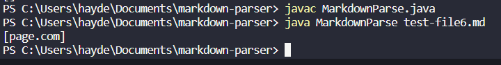

# Lab Report 2

## 1. Bug fix for .md files with spaces between link and parantheses
- Added if(closeBracket - openParen == -1) to check if the closing bracket and open parantheses are touching

- [File that caused bug](https://hpdinh.github.io/cse15l-lab-reports/mytest3-file.html)
- Failed result

- The result of this test before adding the if statement is wrong and thus a bug in the code since it is including "test", "test3", and "test5"  in the arraylist. These strings should not be included because they are not links since there are spaces between the brackets and the parentheses. 

***
## 2. Bug fix for .md files with no links

- Add if(markdown.indexOf("[", currentIndex) == -1 || markdown.indexOf("]",currentIndex) == -1 || markdown.indexOf("(", currentIndex) == -1 || markdown.indexOf(")", currentIndex) == -1) to check if there are enough characters in the line to create a link

- [File that caused the bug](https://hpdinh.github.io/cse15l-lab-reports/test-file3.html)

- Failed Result

- The result of this test before adding the if statement create an index out of bounds error. This is because the     .indexOf() method returns -1 if the character is not found. So when there is no character, the next time .indexOf() is called, it will use -1 resulting in the index out of bounds error.

***

## 3. Bug fix for .md files with images

- Added if(markdown.indexOf("!") + 1 == markdown.indexOf("[")) to check if there is an exclamation point before the bracket. If there is it is an image so break out of the loop

- [File that caused the bug](https://hpdinh.github.io/cse15l-lab-reports/test-file6.html)

- Failed Result

- The result of this test before adding the if statement is wrong because it inputs "page.com" into the array list even though it is an image and not a link. 

