# Lab Report 3

## Streamlining ssh Configuration

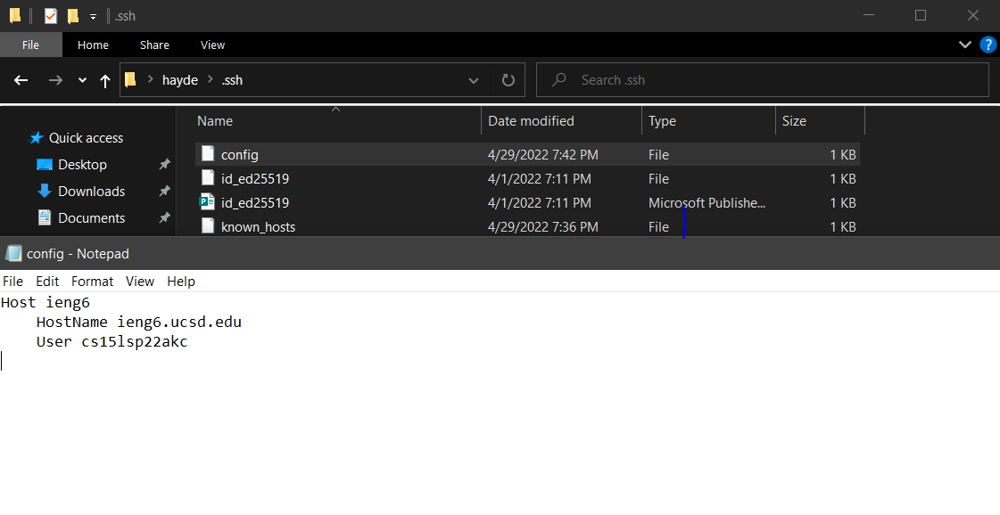
- Added a config file to automatically enter in my long username when ieng6 is inputted. Used notepad to edit the file.

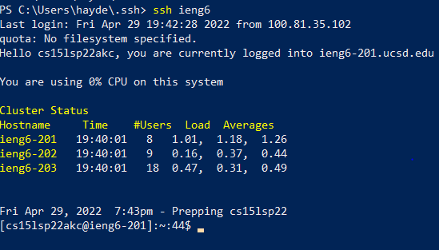

- Adding a file with scp using ieng6
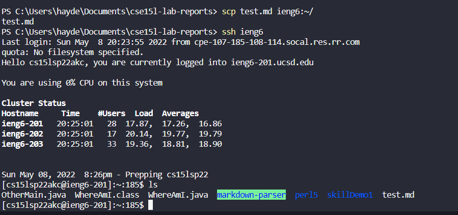

## Set up Github access from ieng6

- Copy of Public key is stored in github account
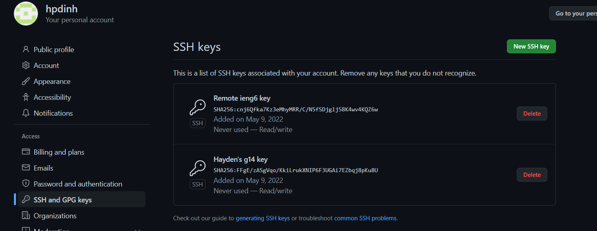

- Private key is stored in ieng6 .ssh folder in id_ed25519
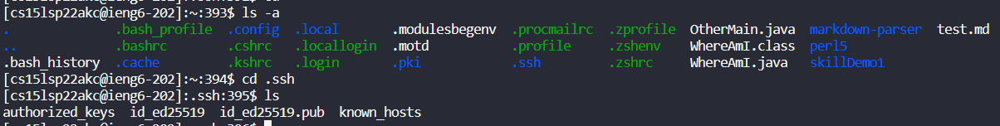

- Commiting and pushing from remote access
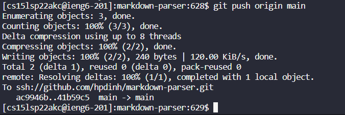
[Commit Link](https://github.com/hpdinh/markdown-parser/commit/41b59c543439f222084752632798b25fffee7f7f)

## Copy from whole directories using scp -r

- Copying markdown-parse with scp -r
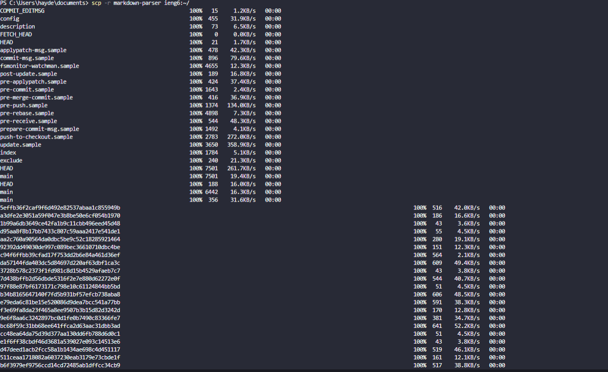
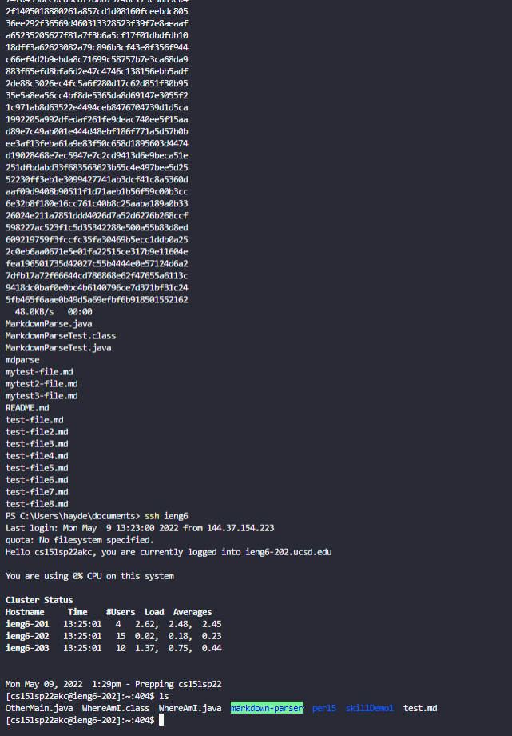

- Running junit tests after copying into remote ieng6
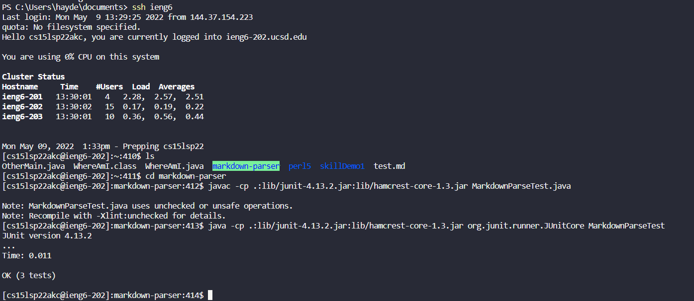

- Copying directory over to remote using scp and also running test in one line

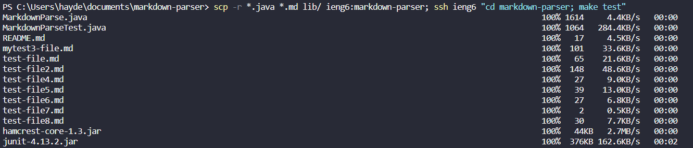
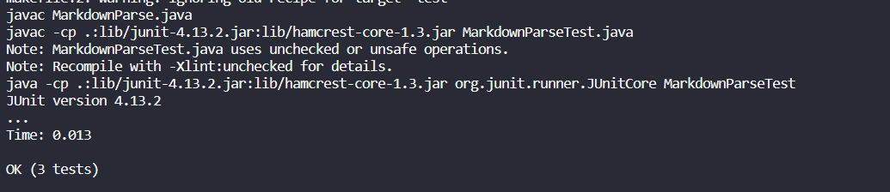
