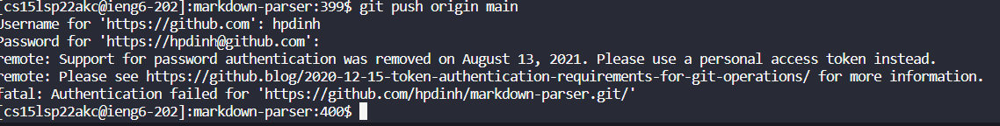

# Lab Report 3

## Streamlining ssh Configuration

- Added a config file to automatically enter in my long username when ieng6 is inputted. Used notepad to edit the file.

- Adding a file with scp using ieng6

## Set up Github access from ieng6

- Copy of Public key is stored in github account

- Private key is stored in ieng6 .ssh folder in id_ed25519

- Pushing from ieng6 still does not work after adding public key to github

## Copy from whole directories using scp -r

- Copying markdown-parse with scp -r

- Running junit tests after copying into remote ieng6

- Copying directory over to remote using scp and also running test in one line
