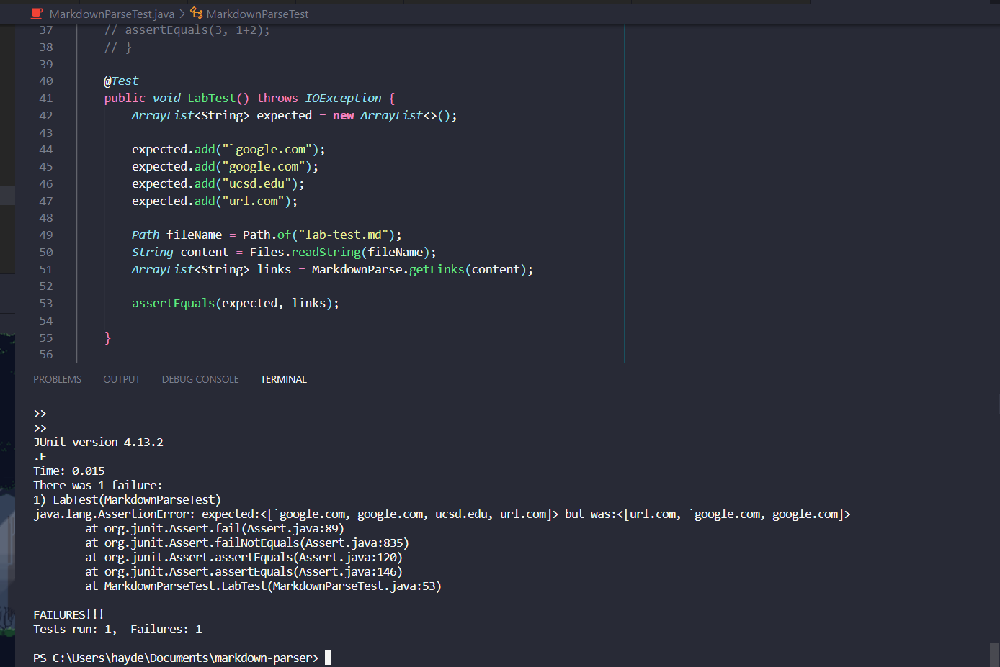
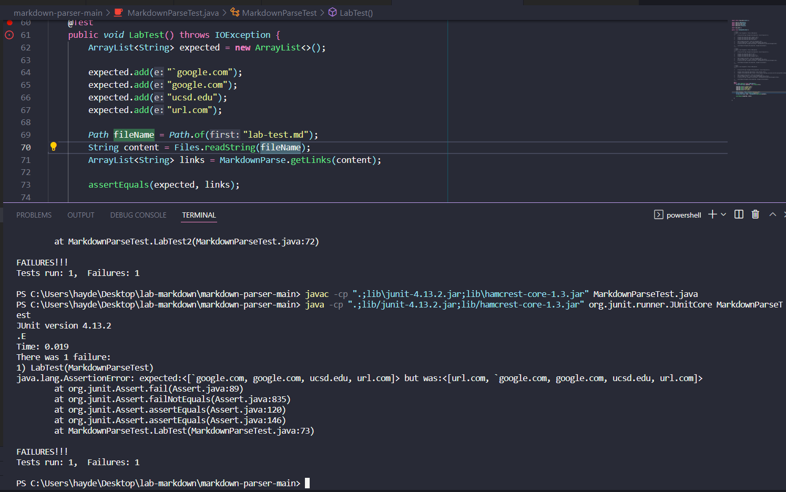
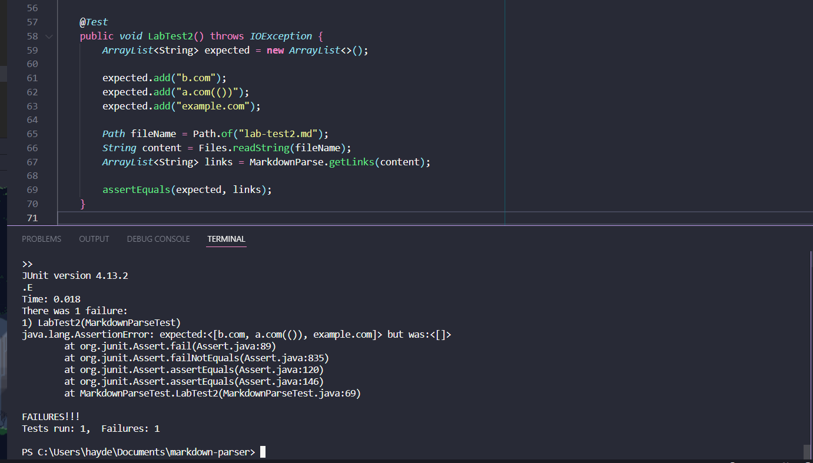
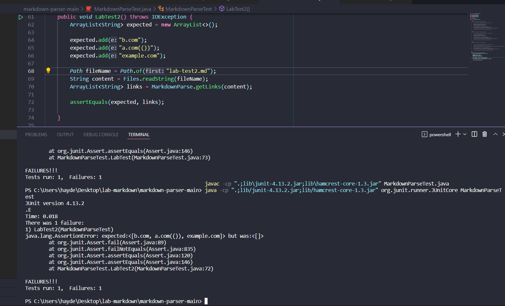
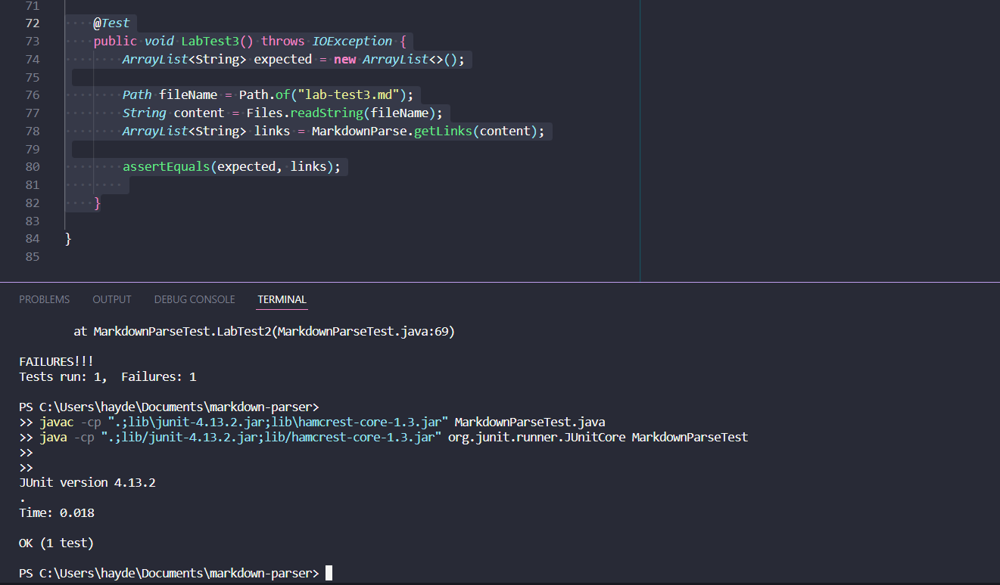
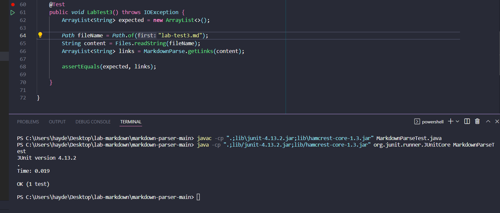

# Lab Report 4

[Link to my repository](https://github.com/hpdinh/markdown-parser)

[Link to other group repository](https://github.com/ayushs2725/markdown-parser)

## Snippet 1

**My markdown-parser**

**Other Group markdown-parser**

For both implementations of markdown-parser failed. The expected did not include "url.com" in the array but the output did. 

#Snippet 2
**My markdown-parser**

**Other Group markdown-parser**

For both implementations of markdown-parser failed. The expected included all the links, but both implmentations included none of them.

#Snippet 3
**My markdown-parser**

**Other Group markdown-parser**

For both implementations of markdown-parser, it passed. Since none of the links in the .md file are in one line, it should not have read in any of the links. This is why the test passed, as both the expeted and output were empty arraylists

# Snippet 1 Fix
For my implementation of markdown-parser, an easy fix would be to change the if statements I created to look for images, links that start with !. However, since in my implementation I only look for "!", it did not work when "`" was in front of the link. 

# Snippet 2 Fix
To fix the error in this test case, you would have to implement a way to not count the brackets inside of the heading for the link. This would require an entirely new method which utilizes a while loop to search for the specific parantheses.

# Snippet 3 Fix
Since both implementations passed, a fix is not needed. The code I added to pass this test was an if statement that made sure that the closing bracket and opening parentheses were touching which prevented the link from going to the next line.

