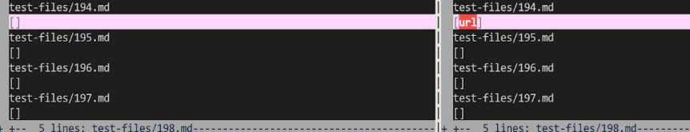

# Lab Report 5

To find the different outputs, I used a .sh file as a script and wrote
```
for file in test-files/*.md;
do
  java MarkdownParse $file
done
```

This ran MarkdownParse on every test file inside of the test-files directiory using a for loop and then used > command to input the results into a .txt file. I ran the directory of test files on both implementations and acquired two .txt files. I then used vimdiff on the two .txt files to compare the resulted outputs.


## Different result 1


[Test File](https://github.com/nidhidhamnani/markdown-parser/blob/main/test-files/194.md)

Neither implementation is correct in this test. In my implementation, I have no links and the provided implementation inputs url into the list as a link

The expected output is my_(url)


This is because when creating a link using markdown, adding a : instead of a parentheses takes in the string as the link.

To fix this bug, the implementation would require looking for a colon and inputting the adjacent string into the list as a link.

This can be done in the markdown-parser's while loop inside of the get_links method to check for the colon


## Different result 2


[Test File](https://github.com/nidhidhamnani/markdown-parser/blob/main/test-files/342.md)

My implementation is correct and the provided implementation has an incorrect output with /foo being inputting into its list of links

The expected output should be an empty array


This is because the backtick in markdown formats the line as a block of code. Since `link](/foo`) is between backticks, it would be a line of code in markdown thus making it not a link


