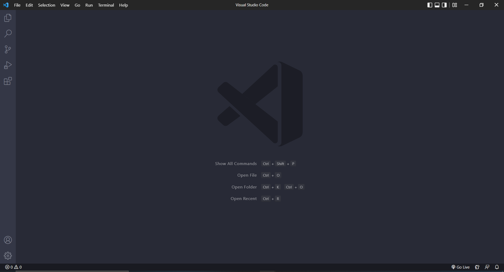
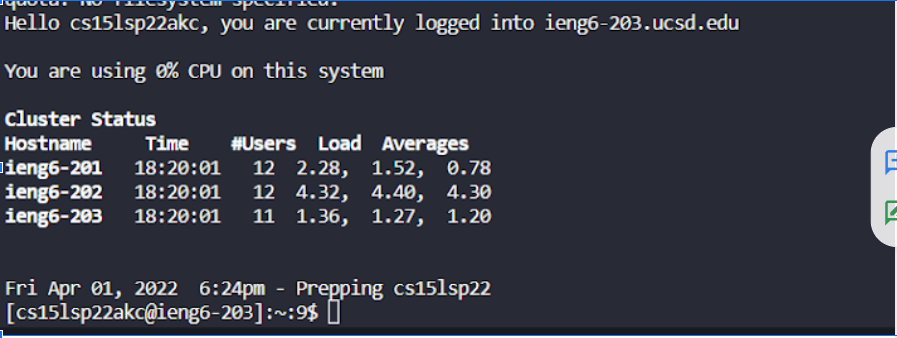
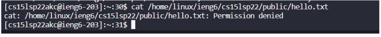
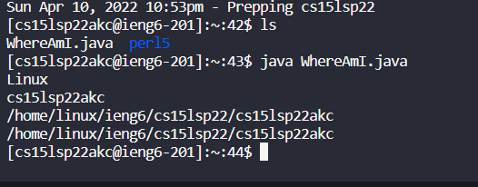
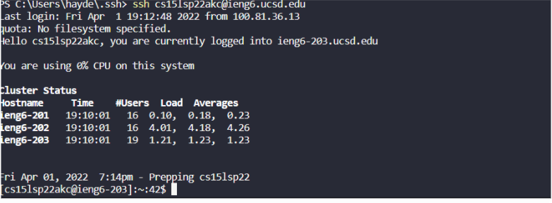
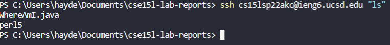
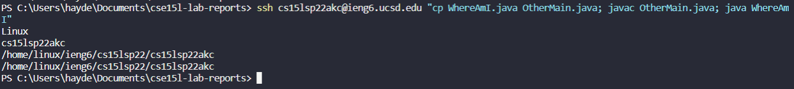

## CSE15L Lab Report 1

# **Installing VScode**

1. Google *VScode*
2. Click on the first [link](https://code.visualstudio.com/)
- How VScode should look 

*** 
#  Remotely Connecting

1. Install openssh
2. Open terminal inside vscode and type ssh cs15lsp22zz@ieng6.ucsd.edu (replace zz with your letters for specific account)
3. Say yes to any messages 

-How the terminal should look after logging in 

***


# Trying some Commands

1. Run the commands  cd, ls, pwd, mkdir, and cp in terminal
2. 
    - cd ~
    - cd
    - ls -lat
    - ls -a
    - ls /home/linux/ieng6/cs15lsp22/cs15lsp22abc  where the abc is one of the other group members’ username
    - cp /home/linux/ieng6/cs15lsp22/public/hello.   txt ~/
    - cat /home/linux/ieng6/cs15lsp22/public/hello.txt 

    ***

    # Moving files with scp
    
    - Note: Do this step on the client, your **computer** not logged into ieng6

    1. Create a file on your computer called WhereAmI.java and input 
    ```
    class WhereAmI {
        public static void main(String{} args) {
            System.out.println(System.getProperty("os.name"));
            System.out.println(System.getProperty("user.name"));
            System.out.println(System.getProperty("user.home"))
            System.out.println(System.getProperty("user.dir"));
        }
    }

    ```
    - Compile
    2. scp WhereAmI.java cs15lsp22zz@ieng6.ucsd.edu:~/ will prompt password
    3. Log back into ieng and ls, you should be able to see it 
    4. Compile it and run it using javac and java
    

---

# Setting an SSH key
- Note: Do this step on your client, your **computer** not logged into ieng6

1. Input into terminal
```
$ ssh-keygen (if using windows ssh-keygen -t ed25519)
Generating public/private rsa key pair.
Enter file in which to save the key (/Users/<user-name>/.ssh/id_rsa): /Users/<user-name>/.ssh/id_rsa
Enter passphrase (empty for no passphrase): 
```
- Note: Leave passphrase empty for this step
 
 ```
 Enter same passphrase again: 
Your identification has been saved in /Users/<user-name>/.ssh/id_rsa.
Your public key has been saved in /Users/<user-name>/.ssh/id_rsa.pub.
The key fingerprint is:
SHA256:jZaZH6fI8E2I1D35hnvGeBePQ4ELOf2Ge+G0XknoXp0 <user-name>@<system>.local
The key's randomart image is:
+---[RSA 3072]----+
|                 |
|       . . + .   |
|      . . B o .  |
|     . . B * +.. |
|      o S = *.B. |
|       = = O.*.*+|
|        + * *.BE+|
|           +.+.o |
|             ..  |
+----[SHA256]-----+
 ```
2. This has now created two keys on your client, a public(id_rsa.pub) and private one(id_rsa). These are stored in .ssh directory on your computer. We need to copy the **public** key to the .ssh directory of your user account on the server

```
$ ssh cs15lsp22zz@ieng6.ucsd.edu
<Enter Password>
# now on server
$ mkdir .ssh
$ <logout>
# back on client
$ scp /Users/<user-name>/.ssh/id_rsa.pub cs15lsp22zz@ieng6.ucsd.edu:~/.ssh/authorized_keys
# You use your username and the path you saw in the command above
```
3. You should now be able to log back into your account on the server without a password


# Optimizing Remote Running
- You can write commands in quotes at the end of ssh to run it after logging in
```
$ ssh cs15lsp22zz@ieng6.ucsd.edu "ls"
```


- You can use semicolons to run multiple commands in the same line 

```
$ cp WhereAmI.java OtherMain.java; javac OtherMain.java; java WhereAmI
```



